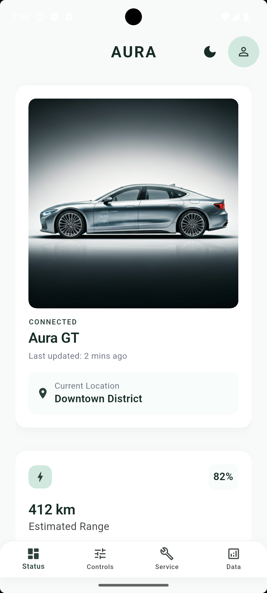
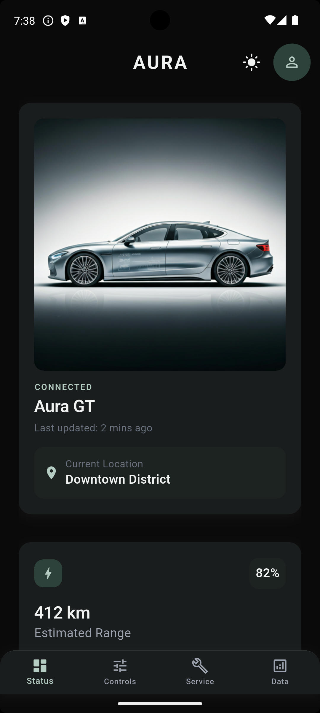
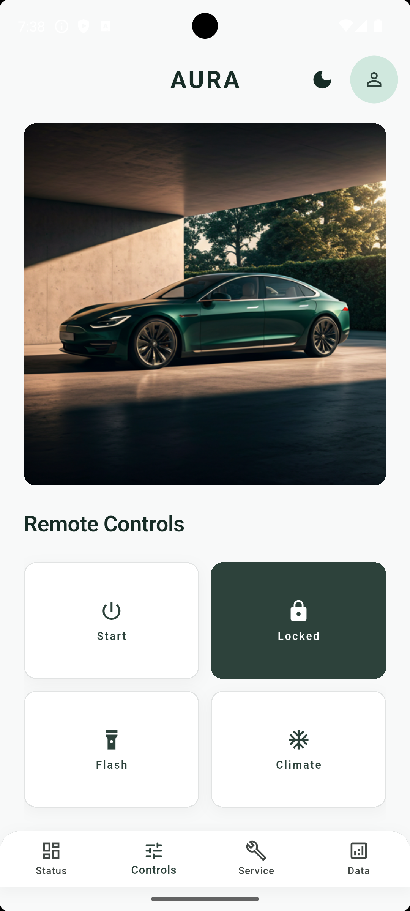
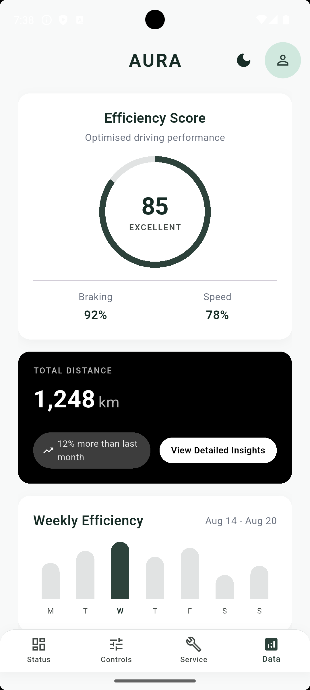

# 🚗 Aura - Connected Car Dashboard

A responsive, theme-adaptive car companion app built with Flutter & Dart. Designed with a clean, modern UI focused on readability, smooth interactions, and production-ready layout architecture.

## ✨ Features
- 🌓 **Light/Dark Mode** with system-adaptive status & navigation bars
- 📱 **Fully Responsive** layout (mobile → tablet) using `LayoutBuilder` & flexible constraints
- 🎨 **Centralized Theme System** (`AppTheme`) for consistent colors, typography, and shadows
- ⚡ **State-Driven UI** for toggles, climate controls, and interactive widgets
- 🧩 **Reusable Widget Architecture** reducing duplication & improving maintainability
- 📉 **Overflow-Safe Layouts** using `Flexible`, `shrinkWrap`, and constraint-aware grids

## 🛠️ Tech Stack
- Flutter 3.x | Dart
- Material 3 Theming
- `StatefulWidget` + `setState`
- `SingleChildScrollView`, `GridView.count`, `AnimatedSwitcher`
- Edge-to-edge system UI handling

## 📸 Screenshots
| Light Mode | Dark Mode | Controls | Analytics |
|------------|-----------|----------|-----------|
|  |  |  |  |

## 🧠 Key Challenges & Solutions
| Challenge | Solution |
|-----------|----------|
| Yellow/black overflow stripes on narrow screens | Replaced fixed heights with `Flexible`, `mainAxisSize.min`, and `maxLines + overflow` |
| Hardcoded colors causing inconsistent dark mode | Centralized all tokens in `AppTheme`, passed `BuildContext` to adaptive helpers |
| Scroll conflicts inside `SingleChildScrollView` | Added `shrinkWrap: true` + `NeverScrollableScrollPhysics()` to nested grids |

## 🚀 How to Run
```bash
flutter pub get
flutter run


📁 Project Structure
lib/
├── main.dart              # App entry + theme setup
├── utils/
│   └── app_theme.dart     # Centralized colors, typography, shadows, system UI
├── screens/
│   ├── main_scaffold.dart # Bottom nav, tab switching, theme toggle
│   ├── dashboard_screen.dart
│   ├── controls_screen.dart
│   ├── maintenance_screen.dart
│   └── analytics_screen.dart


🤝 Contact
GitHub: https://github.com/alamin-omoyele/
LinkedIn: https://www.linkedin.com/in/al-amin-mohammed/
Email: alamin.omoyele@gmail.com
